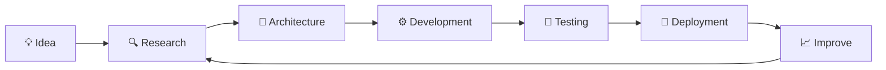

<!-- =========================================================
     HIMANSHU KUMAR — GITHUB PROFILE README
     Premium Glass / Developer Portfolio Style
     ========================================================= -->

<div align="center">


<br/>


<br/><br/>

<a href="https://github.com/nahilist">
  
</a>
&nbsp;
<a href="https://linkedin.com/in/himanshux64">
  
</a>
&nbsp;
<a href="https://drive.google.com/file/d/1yGZ26o7WLiyysw6PWk2mlbnqs5TQLeUf/view?usp=drivesdk">
  
</a>

<br/><br/>


&nbsp;


</div>

<br/>

---

## `01.` 👨‍💻 About Me

<table>
<tr>
<td width="62%" valign="top">

### Building at the intersection of **AI × Engineering × Design**

I'm **Himanshu Kumar**, an Artificial Intelligence & Machine Learning student focused on building useful products by combining intelligent systems with modern frontend engineering.

I enjoy taking ideas from:

**Problem → Research → Architecture → Development → Deployment**

My current interests include **Machine Learning, LLM Engineering, AI Agents, Computer Vision, intelligent web applications, and modern frontend architecture**.

- 🎓 Studying **Artificial Intelligence & Machine Learning**
- 🧠 Exploring **LLMs, AI Agents, RAG and Deep Learning**
- 🌐 Building modern **AI-powered web applications**
- ✍️ Writing AI/ML learnings on **[Medium](https://medium.com/@himanshux64)**
- 🤝 Open to **internships, research, open source and collaborations**
- 💬 Ask me about **Python, Machine Learning and Frontend Engineering**
- ⚡ GitHub commits mysteriously increase near project deadlines

</td>

<td width="38%" align="center">

### Current Mode

```text
╭──────────────────────────────╮
│                              │
│   STATUS   Building          │
│   FOCUS    AI Engineering    │
│   MODE     Learning          │
│   LEVEL    Improving ↑       │
│                              │
╰──────────────────────────────╯
```

**Think → Build → Break → Learn → Repeat**

</td>
</tr>
</table>

<br/>

> ### “Learning is never cumulative; it is a movement of knowing which has no beginning and no end.”
> — **Jiddu Krishnamurti**

<br/>

---

## `02.` 🧭 Current Focus

<div align="center">

| | Domain | What I'm Exploring |
|---|---|---|
| 🤖 | **AI Agents** | Tool use, planning, orchestration, memory and autonomous multi-step workflows |
| 🧠 | **LLM Engineering** | Prompt systems, structured output, evaluation, RAG, chaining and reliability |
| ⚡ | **AI Web Applications** | Bringing intelligent features into production-ready web experiences |
| 👁️ | **Deep Learning** | CNNs, RNNs, LSTMs, Transformers, NLP and Computer Vision |
| 🏗️ | **System Design** | Designing scalable application architecture and AI-powered systems |
| 🎨 | **Frontend Engineering** | Responsive UI, component systems, performance and polished interactions |

</div>

<br/>

---

## `03.` ⚙️ Technology Stack

<div align="center">

### Languages


<br/><br/>

### Frontend


<br/><br/>

### AI / Machine Learning


<br/><br/>

### Backend & Data


<br/><br/>

### Developer Tools


</div>

<br/>

---

## `04.` 🚀 Featured Projects

<table>
<tr>
<td width="50%" valign="top">

### 🔢 Handwritten Digit Classifier

A convolutional neural network trained on the **MNIST dataset** to identify handwritten digits.

**Engineering focus**

- Image preprocessing
- CNN architecture
- Model training
- Classification
- Performance evaluation

**Stack**

`Python` `TensorFlow` `Keras` `CNN`

**Status:** `Production Demo / Built ✅`

</td>

<td width="50%" valign="top">

### 📝 AI Notes Summarizer

An AI-powered workflow that transforms long-form notes into concise and readable summaries.

**Engineering focus**

- LLM integration
- Prompt workflows
- Text processing
- Streamlit UI
- Structured summarization

**Stack**

`Python` `LangChain` `LLMs` `Streamlit`

**Status:** `Built ✅`

</td>
</tr>
</table>

<br/>

<div align="center">

### More experiments live inside my repositories.

<a href="https://github.com/nahilist?tab=repositories">
  
</a>

</div>

<br/>

---

## `05.` 🏗️ How I Build



<br/>

My goal is not only to make software **work**.

I care about building software that is:

`Useful` · `Maintainable` · `Understandable` · `Scalable` · `Thoughtfully Designed`

<br/>

---

## `06.` 📊 GitHub Dashboard

<div align="center">


</div>

<br/>

<div align="center">


</div>

<br/>

---

## `07.` 🕹️ Contribution Activity

<div align="center">

<picture>
  <source
    media="(prefers-color-scheme: dark)"
    srcset="https://raw.githubusercontent.com/nahilist/nahilist/output/pacman-contribution-graph-dark.svg"
  />
  <source
    media="(prefers-color-scheme: light)"
    srcset="https://raw.githubusercontent.com/nahilist/nahilist/output/pacman-contribution-graph.svg"
  />
  
</picture>

</div>

<br/>

---

## `08.` 📈 Activity Overview

<div align="center">


</div>

<br/>

---

## `09.` 🧩 Engineering Interests

```text
AI Engineering
├── Machine Learning
├── Deep Learning
├── Large Language Models
├── Retrieval-Augmented Generation
├── AI Agents
├── Computer Vision
└── Intelligent Automation

Software Engineering
├── Frontend Architecture
├── API Integration
├── Full-Stack Applications
├── Database Design
├── Authentication
├── System Design
└── Deployment

Learning
├── Research Papers
├── Open Source
├── Technical Writing
├── Experimentation
└── Building in Public
```

<br/>

---

## `10.` 🧠 Developer Philosophy

<table>
<tr>
<td align="center" width="33%">

### `01`

**Understand First**

Technology matters less than understanding the problem being solved.

</td>
<td align="center" width="33%">

### `02`

**Build Thoughtfully**

Clean architecture and maintainable code matter beyond the first release.

</td>
<td align="center" width="33%">

### `03`

**Keep Learning**

Engineering changes constantly. Curiosity must remain permanent.

</td>
</tr>
</table>

<br/>

---

## `11.` ✍️ Writing & Learning

I document concepts while learning because **explaining something clearly is one of the best ways to understand it deeply**.

Topics I enjoy writing about:

- Machine Learning fundamentals
- AI engineering
- Large Language Models
- RAG systems
- AI Agents
- Frontend engineering
- Developer workflows
- System design
- Lessons learned while building projects

<div align="center">

<a href="https://medium.com/@himanshux64">
  
</a>

</div>

<br/>

---

## `12.` 🌐 Digital Presence

<div align="center">

<a href="https://linkedin.com/in/himanshux64">
  
</a>
&nbsp;

<a href="mailto:himanshukx64@gmail.com">
  
</a>
&nbsp;

<a href="https://medium.com/@himanshux64">
  
</a>
&nbsp;

<a href="https://leetcode.com/himanshux64">
  
</a>
&nbsp;

<a href="https://github.com/nahilist">
  
</a>

</div>

<br/>

---

<div align="center">

### `OPEN TO`

`Internships` · `AI Projects` · `Research` · `Open Source` · `Collaborations`

<br/>

### 💡 Learning continuously. Building thoughtfully. Creating intelligent software.

<br/>


<br/>


</div>
